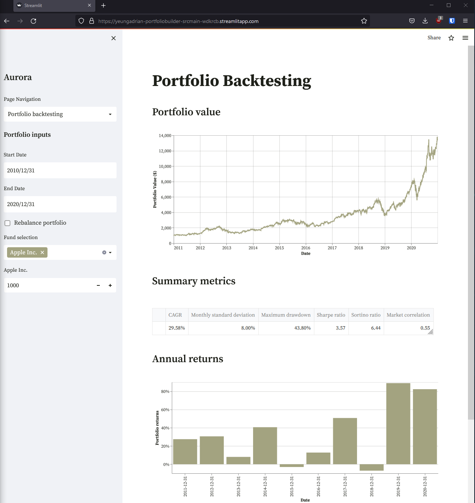
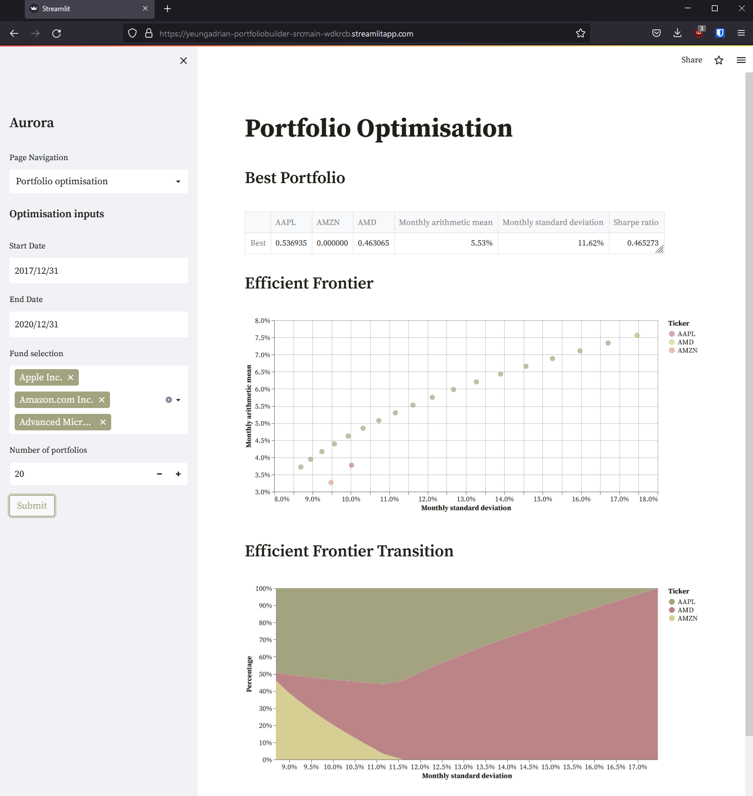

# PortfolioBuilder

Portfolio analytics tools to help compare portfolios deployed on streamlit cloud

## Financial Analysis:
- Portfolio Backtesting
    - Backtest different asset allocations and compare historical performance
- Factor Analysis
    - Run regression analysis using French-Fama / other factor models
- Portfolio Optimisation
    - Generate efficient frontiers to explore risk return trade offs

