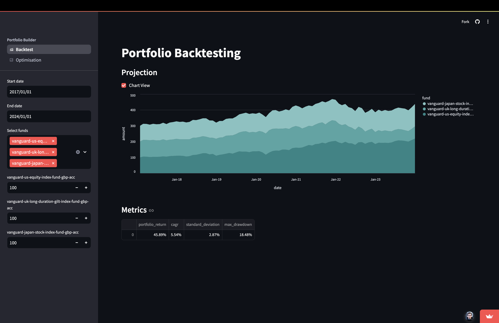
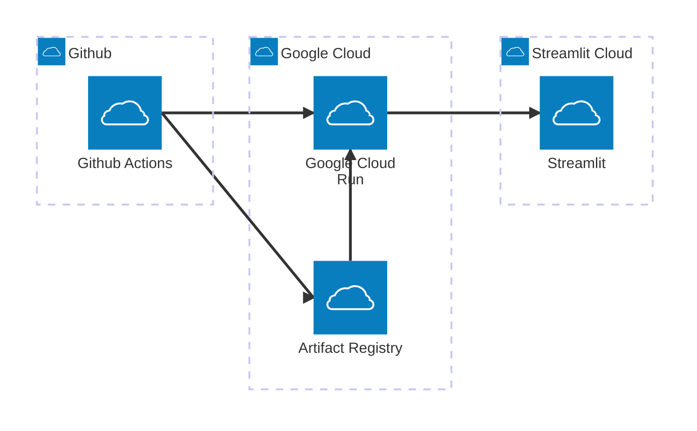

# PortfolioBuilder

<p align="center">
<a href="https://github.com/yeungadrian/PortfolioBuilder/actions/workflows/test.yml?query=branch%3Amain+event%3Apush+" target="_blank">
    
</a>
<a href="https://github.com/yeungadrian/PortfolioBuilder/actions/workflows/build-push.yml?query=branch%3Amain" target="_blank">
    
</a>
<a href="https://github.com/yeungadrian/PortfolioBuilder/actions/workflows/deploy.yml?query=branch%3Amain" target="_blank">
    
</a>
</p>



View live API docs @ https://portfoliobuilder-jfv66mvjvq-ew.a.run.app/redoc

Goals:
1. Minimalish but still effective FastAPI + Github Action setup
2. Exploring severless with Google Cloud (Artifact Regsitry, Cloud Run)
3. Refresh knowledge on portfolio optimisation

## Quickstart
Run locally with uv
```
uv sync --all-extras
uv run uvicorn app.main:app --reload
uv run streamlit run streamlit_app.py
```
Run locally with docker
```
docker build -t portfoliobuilder .
docker run --rm -it -p 8000:8000/tcp portfoliobuilder:latest
```
## Architecture


Note: Mermaid supported icons is very limited for now.
